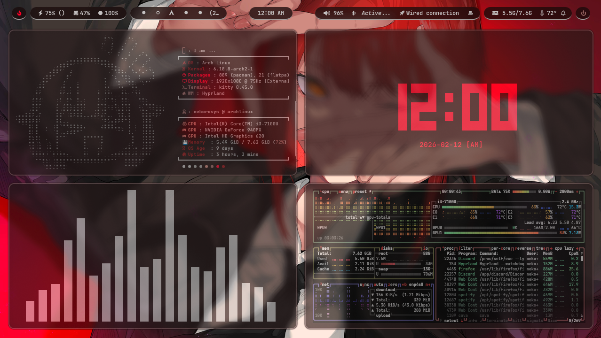
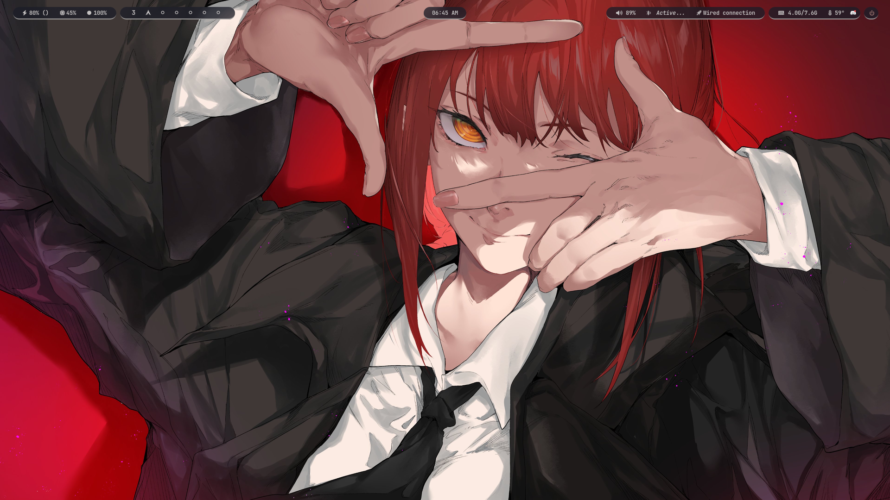
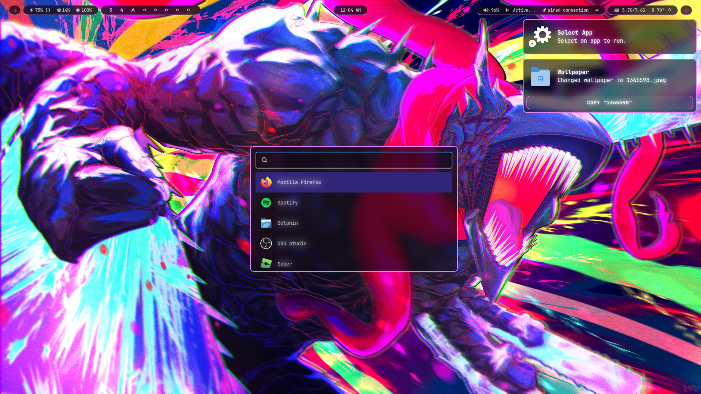
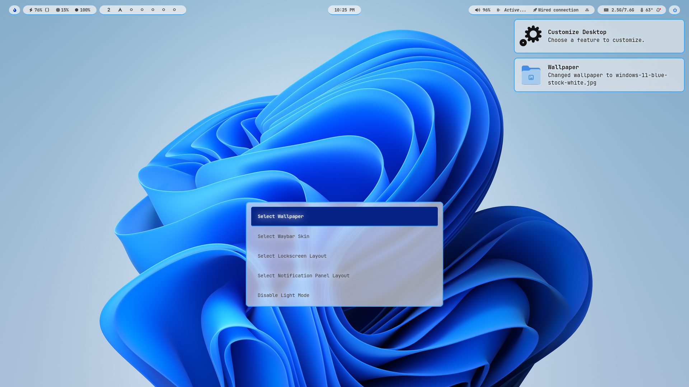
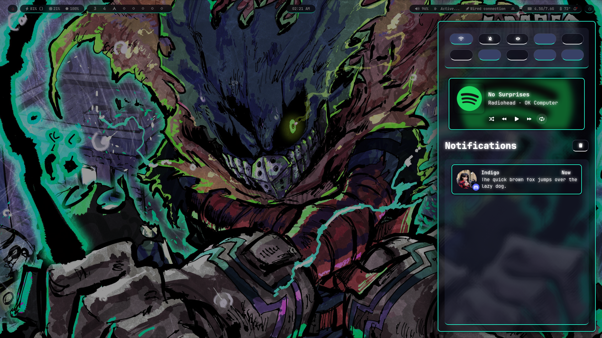

  

            

 

 
  

     
 

 

> [!TIP]
> [NeKoRoSHELL DLux](https://github.com/NeKoRoSYS/NeKoRoSHELL-DLux-Shell/) is under development. Check it out now!

 

The best way to say *"I use Linux btw 🤓"* is if your desktop environment looks sleek and suave.

Powered by Hyprland, this project does not define itself as "just a rice." **NeKoRoSHELL** aims to provide an out-of-the-box, clean and reliable, generic, and modular framework that lets you easily customize your desktop experience with simple UI design philosophy in mind.

 

 
| 📌 **Table of Contents** |
| :---: |
| 🚀 [Features](#features) |
| 🔗 [Dependencies](#dependencies) |
| ♥ [Acknowledgements](#acknowledgements) |

 

  

<h2 align="center"> <a id="features">Features</a> </h2>
 

NeKoRoSHELL focuses on simplicity and modularity.

The following are what NeKoRoSHELL currently offers:

- **Portable and Distro-agnostic**
  - Use NeKoRoSHELL in any **supported** distro!
  - Init-agnostic.
  - XDG-compliant.
  - Features an advanced installer script.
    - Use `git clone https://github.com/NeKoRoSYS/NeKoRoSHELL`
    - Then `cd NeKoRoSHELL`
    - and finally, `bash install.sh` to install the dotfiles.
    - `install.sh` assumes you already have `git` and a distro-specific `g++` compiler.
    - `install.sh` requires you to have `cargo`, `paru`/`yay`, `go`, and `flatpak`.
    - You can freely customize `flatpak.txt` and `pkglist-DISTRO.txt` before running `install.sh`.
    - **The installer is safe.** It backs up your pre-existing .config folders. (If you have any)
    - The installer automatically handles assigning your monitors at `~/.config/hypr/configs/monitors.conf/` and replaces every occurence of `/home/nekorosys/` with your username for your own convenience.
    - SOME distros don't have hyprland or other dependencies on their package manager's repository and you may have to manually build them from source via script or something else.

- **NeKoRoSHELL as a Service**
  - Update your copy of NeKoRoSHELL simply by running the `nekoroshell update` command on your terminal.
  - Uses Vim or your preferred text editor to assist in reviewing file updates and gives the ability to overwrite, keep, and merge.
   
- **Window Controls**
  - Maximize & Fullscreen
  - Toggle Opacity
  - Toggle Floating Window
  - Pseudo-floating/organized windows
  - Change tile placement

- **Copying and Pasting**
  - Screenshot support via `hyprshot` .
  - Clipboard history via `cliphist`.
 
- **Notificications Handling**
  - Uses `SwayNC` for a dedicated notification center with customizable buttons and options.
 
- **Smart Navbar**
  - Uses portable WM-agnostic C++ wrappers for `waybar` to toggle visibility modes: Static, Dynamic, and Hover.

  

- **Advanced Customization - Make NeKoRoSHELL YOURS!**
  - NeKoRoSHELL is not just an identity, it is a framework. This repo gives you at most 2 pre-installed out-of-the-box layouts/styling for waybar, hyprlock, and SwayNC. The best part? You can make your own!
  - Switch to Dark and Light contrast modes
  - [Dedicated Theming System](THEMING.md):
    - Select individual skins for waybar, rofi, hyprlock, SwayNC, wlogout, and even hyprland windows.
    - **Wallpaper Handling**
      - Supports both online and offline image (via `swww`) and video (via `mpvpaper`) formats.
        - `mpvpaper` automatically stops if an app is on fullscreen mode to save CPU/RAM and GPU space.
        - Paste image or video links with valid file extensions in the rofi prompt and the download will automatically be processed, saved, and set as your new wallpaper.
      - Uses `wallust` to dynamically update border and UI colors based on the percieved colors of from the wallpaper.
    - Make and select your own Themes that automatically apply skins and wallpapers.

 

  
  
  
  

 

<h2 align="center"> Roadmap </h2>
 

NeKoRoSHELL is currently being developed by one person (*cough* [CONTRIBUTING](https://github.com/NeKoRoSYS/NeKoRoSHELL/tree/main?tab=contributing-ov-file#) *cough*) and is constantly under rigorous quality assurance for improvement. We always aim to keep a "no-break" promise for every update so that you can safely update to later versions without expecting any breakages.

 

| 📋 **TODO** | **STATUS** |
| :--- | :---: |
| Improve base "legacy" theme | ✅ |
| Implement base functionality | ✅ |
| Implement base QOL features | ✅ |
| Optimizations | ✅ |
| Color Handling - Replace pywal6 with wallust | ✅ |
| Dmenu Overhaul - Replace wofi with rofi | ✅ |
| Theme System - Set all skins in one go | ✅ |
| wlogout integration | ✅ |
| Support for hi-res monitors | ✅ |
| Wiki/Docs | 🛠️ |
| BETA: Support for other distros; Verified working on: Arch | 🔍 |
| BETA: Make NeKoRoSHELL init-agnostic; Verified working on: Arch | 🔍 |
| Qt and Kvantum integration | 🤔 |

 

<h2 align="center"> Beyond "NeKoRoSHELL" </h2>
 

In the near future, I plan to expand upon what makes NeKoRoSHELL, well, "NeKoRoSHELL." The following plans MAY or MAY NOT happen, so do take it with a grain of salt:
- **NeKoRoSHELL Headless**: A plug-and-play fork of NeKoRoSHELL that lets you integrate the config files and scripts to any wayland-based window manager/compositor.
- **NeKoRoSHELL DLux (2.0)**: A reimagining of NeKoRoSHELL that uses Quickshell instead of waybar, SwayNC, rofi, and other packages in an effort to unify everything into a seamless experience. The release of DLux will effectively rebrand this project as "NeKoRoSHELL Legacy."

 

 

<h2 align="center"> <a id="dependencies">Dependencies</a> </h2>
 

> [!CAUTION]
> **HARDWARE SPECIFIC CONFIGURATION** 
>
> Some environment variables and params at `~/.config/hypr/configs/environment.conf/` and `~/.config/hypr/scripts/set-wallpaper.sh/` (also check the `check-video.sh` script, `mpvpaper` uses a "hwdec=nvdec" param) **require an NVIDIA graphics card**. Although it may be generally safe to leave it as is upon installing to a machine without such GPU, I recommend commenting it out or replacing it with a variable that goes according to your GPU.

> [!WARNING]
> **SOFTWARE SPECIFIC CONFIGURATION** 
>
> This project of mine was originally built only for Arch Linux but is now capable of claiming itself to be Distro-agnostic. However, **installation of this repo in other Linux Distros aside from Arch is more or less UNTESTED.** Please verify using `nano` or your preferred text editor if your distro supports the packages listed at `pkglist-DISTRO.txt` or if the packages are named correctly.
>
> The installation system that I implemented can be improved. If you're willing to help, please make a pull request. Your contributions are welcome and will be appreciated! :D

- `nekoroshell update` may use Vim to compare, overwrite, or merge files when updating.
- Auto-pause animated wallpapers via [mpvpaper-stop](https://github.com/pvtoari/mpvpaper-stop) (dependencies: cmake, cjson)
  - Used at `set-wallpaper.sh` and `check-video.sh` in `~/.config/hypr/scripts/wallpapers/` to save CPU/RAM usage.
- Install [Hypremoji](https://github.com/Musagy/hypremoji)
- Fix waybar tray disappearing after a certain amount of time by installing `sni-qt`. Make sure you're not killing waybar using `-SIGUSER2` when refreshing the config.

 

 

<h2 align="center"> <a id="acknowledgements">Acknowledgements</a> </h2>
 

- NeKoRoSHELL is fundamentally different and built with strict design/philosophy in mind; however, it's worth to mention that it is partially inspired by [JaKooLit's Hyprland Dots](https://github.com/JaKooLit/Hyprland-Dots/). Frankly, I only found out about the repository while I am deep into polising v1.6 and I realized how similar the two projects are. Given this, it is inevitable that I may use their project as reference for future updates while still keeping the features grounded enough to fit into NeKoRoSHELL.
- Amelie ([@S-e-r-a-p-h-i-n-e](https://github.com/S-e-r-a-p-h-i-n-e)) for helping me transition the project from using pywal16 to wallust and letting me borrow a few scripts. Go check out [SeraDOTS](https://github.com/S-e-r-a-p-h-i-n-e/SeraDOTS)!
- April for helping me figure out the cause of the now-fixed "keybinds not working" issue.
- [@MiroBG](https://github.com/MiroBG) for helping me track issues within the repo.
- Credits to [justinmdickey](https://github.com/justinmdickey/publicdots/blob/main/.config/hypr/hyprlock.conf), and [mkhmtolzhas](https://github.com/mkhmtolzhas/mkhmtdots) for their amazing designs.
  - The `legacy` theme was based on mkhmtolzha's waybar stylesheet and layout, just heavily modified and made to be thematically-consistent across packages like SwayNC.

 

<h2 align="center"> Star History </h2>
 

<a href="https://www.star-history.com/#nekorosys/nekoroshell&type=date&legend=bottom-right">
 <picture>
   <source media="(prefers-color-scheme: dark)" srcset="https://api.star-history.com/svg?repos=nekorosys/nekoroshell&type=date&theme=dark&legend=bottom-right" />
   <source media="(prefers-color-scheme: light)" srcset="https://api.star-history.com/svg?repos=nekorosys/nekoroshell&type=date&legend=bottom-right" />
   
 </picture>
</a>

 

<h2 align="center"> Sponsor Me! </h2>
 

  
  <table>
    <tr>
      <td align="center" width="50%">
        <b>My Ethereum Wallet</b>  
        <code>0x5C429b3fdc7E6F7a692C234358ba31492Feb651C</code>  
         
      </td>
      <td align="center" width="50%">
        <b>My Bitcoin Wallet</b>  
        <code>bc1qw80kkgu8yp4mwzuzddygmnyamcjesfavwmer8a</code>  
         
      </td>
    </tr>
  </table>

  
or...

  
  

 

Sponsoring me is not a must but will be immensely appreciated!

 

